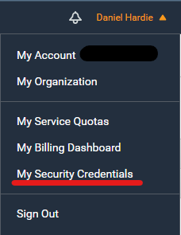
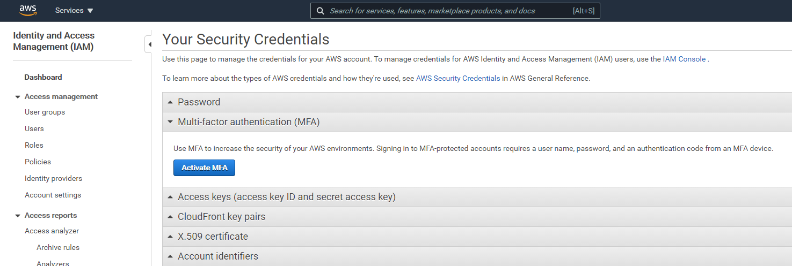
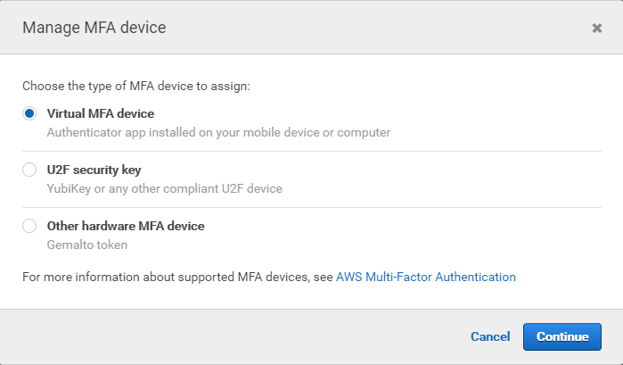
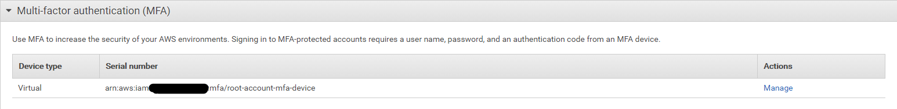

# Getting started with AWS

Hello! Welcome to my little quickstart guide on getting started in AWS! The purpose of this document is to help you set up an AWS account so you can get stuck in and start playing with services in the cloud!

We will cover the following topics:

1. [Creating an AWS root account (with MFA)](#1.-Creating-an-AWS-root-account)
2. [Creating a new user in Identity and Access Management (IAM)](#2.-Creating-a-new-user-in-IAM)
3. [Talking about AWS free tier](#3.-AWS-Free-Tier)

## 1. Creating an AWS root account

The first step is to create an [AWS root user account](https://docs.aws.amazon.com/IAM/latest/UserGuide/id_root-user.html). A root user account is the initial account you must have when using AWS and cannot be deleted without losing access to AWS. This account has no restrictions in AWS permissions, which makes it crucial to ensure the right protections are in place for accessing it. We will set up Multi-factor authentication (MFA) straight after creating this account. To create a new AWS root user account, you can [sign up here](https://portal.aws.amazon.com/billing/signup#/start) and follow the instructions.

### Enabling Multi-factor authentication (MFA)

Once you have the AWS root user account set up and are logged in, I would strongly recommend setting up MFA straight away:

1. Click on your root account name in the top right corner of the AWS navigation header.  
   
2. Click on the "My Sercurity Credentials" option in the dropdown menu  
   
3. Click on the "Activate MFA" button  
   
4. In the "Manage MFA Device" window, select the "Virtual MFA device" option and press the "Continue" button  
   
5. Open you authenticator app of choice, scan the QR code and complete the setup
6. This is what your MFA setup should look like once it is done  
   

## 2. Creating a new user in IAM (optional)

## 3. AWS Free Tier
