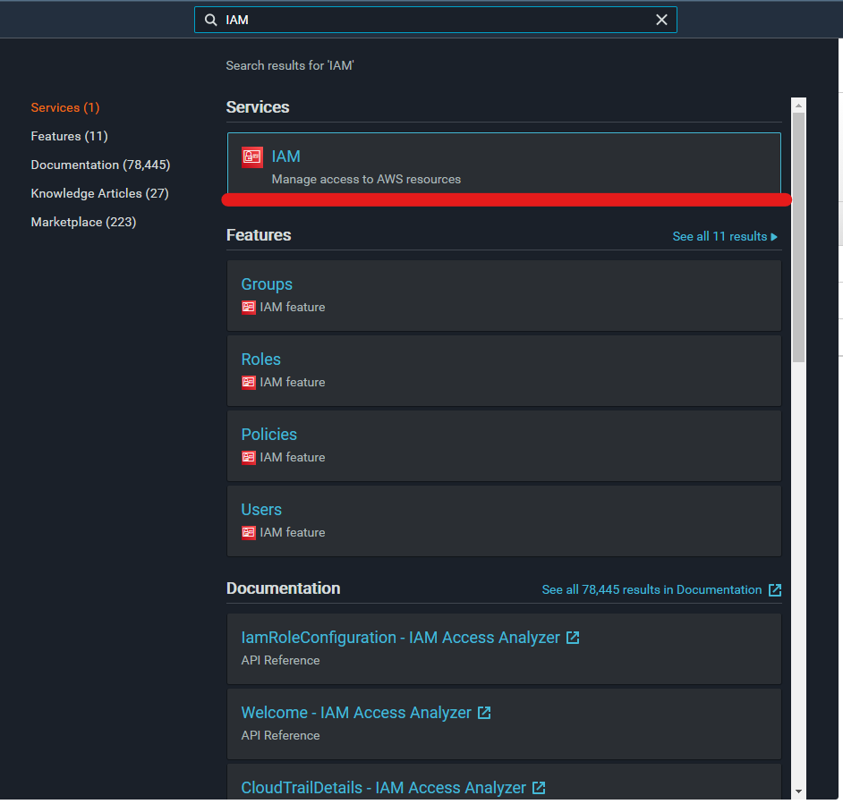
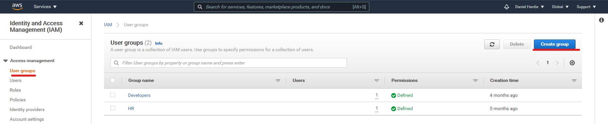
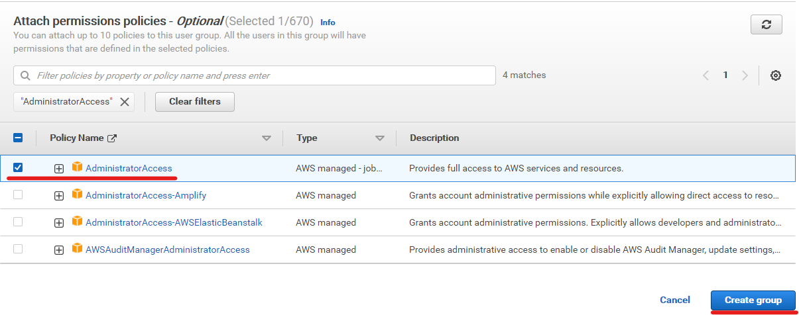
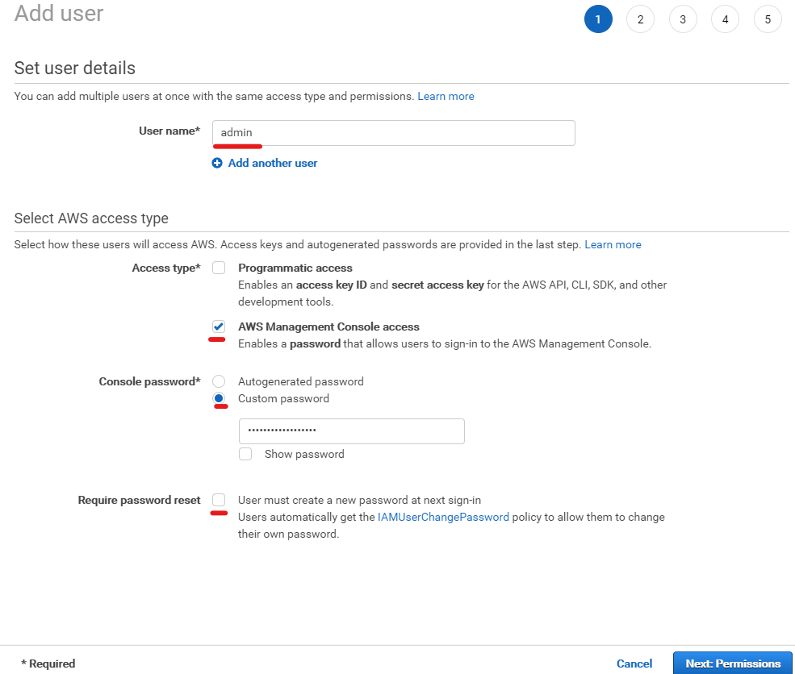
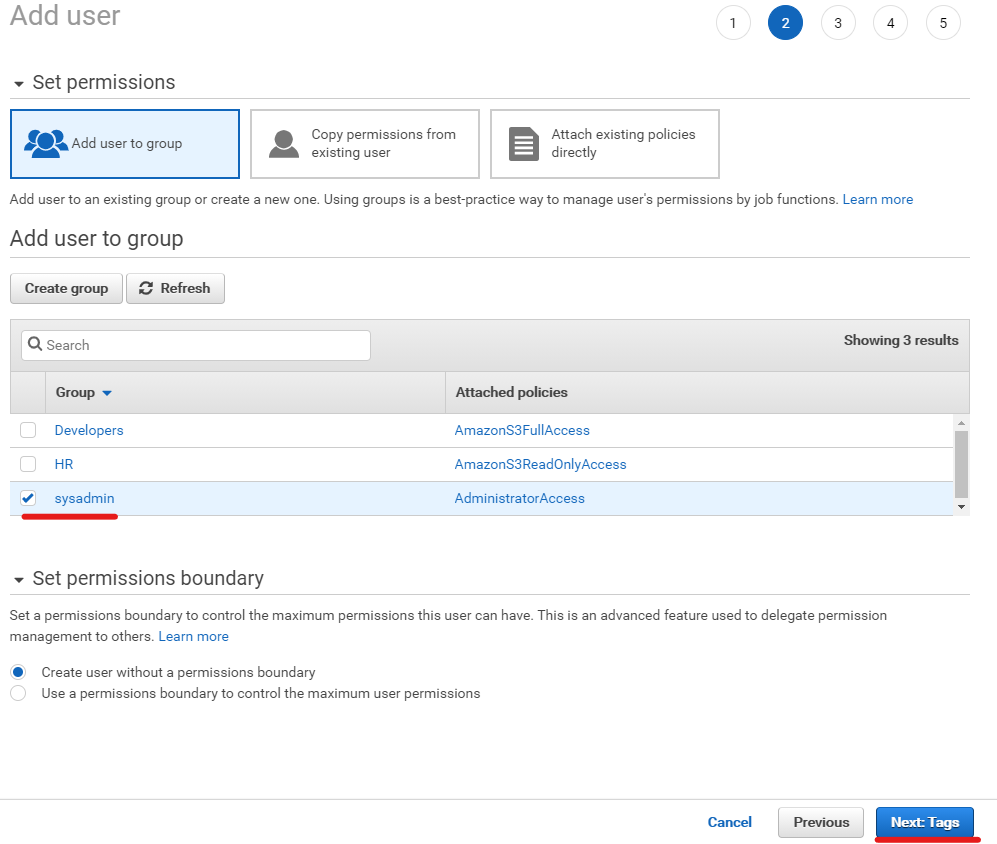
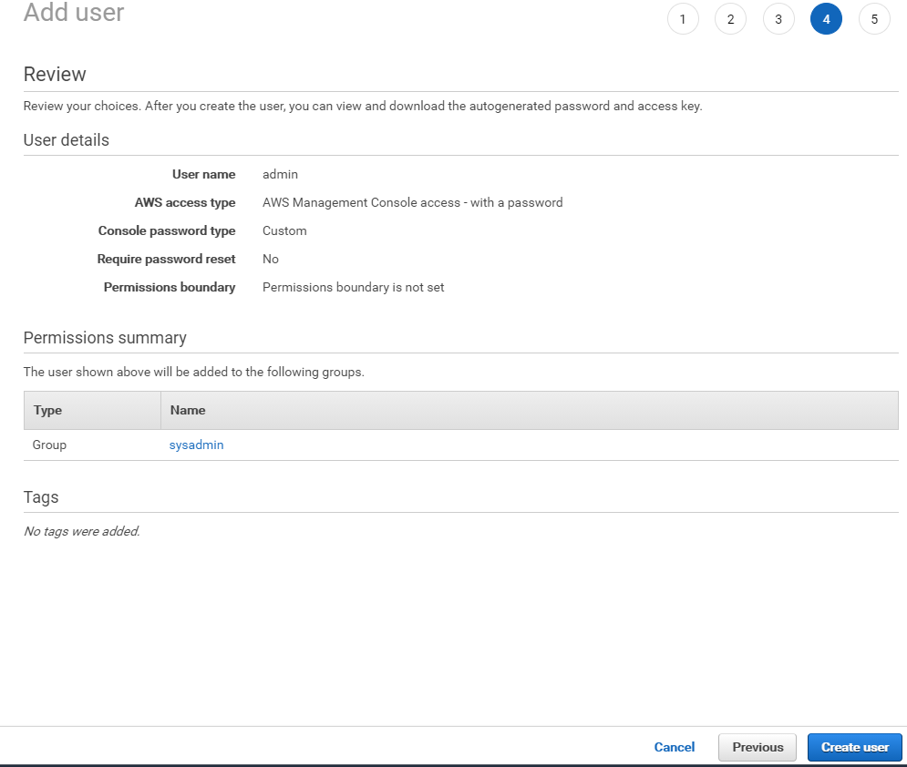
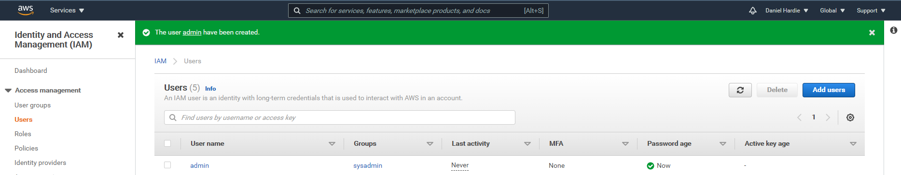
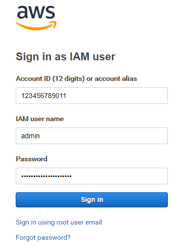

# Getting started with AWS

Hello! Welcome to my little quickstart guide on getting started in AWS! The purpose of this document is to help you set up an AWS account so you can get stuck in and start playing with services in the cloud!

We will cover the following topics:

1. [Creating an AWS root account (with MFA)](#1-Creating-an-AWS-root-account)
2. [Creating a new user in Identity and Access Management (IAM)](#2-creating-a-new-user-in-iam-optional)
3. [Talking about AWS free tier](#3-AWS-Free-Tier)

## 1. Creating an AWS root account

The first step is to create an [AWS root user account](https://docs.aws.amazon.com/IAM/latest/UserGuide/id_root-user.html). A root user account is the initial account you must have when using AWS and cannot be deleted without losing access to AWS. This account has no restrictions in AWS permissions, which makes it crucial to ensure the right protections are in place for accessing it. We will set up Multi-factor authentication (MFA) straight after creating this account. To create a new AWS root user account, you can [sign up here](https://portal.aws.amazon.com/billing/signup#/start) and follow the instructions.

### Enabling Multi-factor authentication (MFA)

Once you have the AWS root user account set up and are logged in, I would strongly recommend setting up MFA straight away:

1. Click on your root account name in the top right corner of the AWS navigation header.  
   
2. Click on the "My Sercurity Credentials" option in the dropdown menu  
   
3. Click on the "Activate MFA" button  
   
4. In the "Manage MFA Device" window, select the "Virtual MFA device" option and press the "Continue" button  
   
5. Open you authenticator app of choice, scan the QR code and complete the setup
6. This is what your MFA setup should look like once it is done  
   

## 2. Creating a new user in IAM (optional)

At this point, you should be signed into AWS with your root account and have set up MFA. So what's next? What if I told you that you should be making another account again? 🤔

As mentioned previously, the AWS root user account has no permissions restricted. This can be quite dangerous, especially when you are learning AWS as you can accidently spin up a service and incur a large cost very quickly without realizing it! The way to get around this is to create a new user within AWS, using the [Identity and Access Management (IAM) service](https://aws.amazon.com/iam/).

The IAM service is how you lock down what users and services can access within AWS. For now, we just want to make a system admin user so that they can still perform most tasks like the root user account, but not have access to EVERY permission (like deleting your AWS account)!

It is up to you if you wish to create a new User, but I strongly recommend it. If you do not, please carry on to [AWS free tier](#3.-AWS-Free-Tier) where we can talk about what you can and can't do for free. If you wish to create a new user, follow on!

### Creating a new system admin (sysadmin) user

As a quick overview in IAM, there are four components:

- Users - there are what humans can use to log into the AWS console (UI)
- User groups - these are what we can categorize Users as, e.g. sysadmins, developers, finance, business, etc. and lock down what services each group can access
- Roles - these are the User group equivalents for AWS services. What does this mean? If you have an AWS service that you only want interacting with one other AWS service, you can define it here to make sure it cannot talk to other services
- Policies - these are json objects that contains the permissions. Policies can be used within User groups and Roles

Alright, so now we have the definitions done, we can move onto making the new sysadmin user. One good rule to always follow in AWS is [The Rule of Least Privilege](https://kirkpatrickprice.com/blog/best-practices-for-privilege-management-in-aws/#:~:text=In%20AWS%2C%20the%20concept%20of,Identity%20and%20Access%20Management%20policies.) which basically locks down all AWS resources so that they can only access what they need to and nothing else.

To begin making a new sysadmin user, search for "IAM" in the search box in the AWS navigation header. Select the IAM service (should be the top option returned).  

Next, head over to the User groups page and click on the "Create group" button

Enter a meaningful group name, e.g. sysadmin. Next, scroll down to the "Attach permissions policies" section. This is the section where we can assign the appropriate permissions for the sysadmin user group. In the search box, enter AdministratorAccess and select the policy which matches this and press the "Create group button".

Nice! If you go back to the User groups page you should see the sysadmin group appear. Now that we have our User group ready to go, we just need to make a new user. Go to the Users section within IAM and click the "Add users" button.

To start off add in a user name, something like admin should suffice. Next, you can decide what acess type this account can have. To keep things simple, I recommend just ticking the AWS Management Console access (which is access to the UI). The Programmatic access generates keys so the account can use the AWS CLI (Command line interface), but this is out of scope for this tutorial. Finally enter in a password and uncheck the Require password reset. Your page should look something like this:

Now press the "Next: Permissions" button to move forward. You should see the newly created sysadmin User group you just made, so select this option and press the "Next: Tags" button.

Skip through the Tags page and press the "Next: Review" button to head over to the Review page. Your page should look like this:

Hit the "Create user" button. If you go back to the Users page in the IAM, you should see the admin user created!

To log in with your new admin account, open a new window in a different browser and head to the [console sign in page](https://console.aws.amazon.com/console/home). From here, select the IAM user option and enter your 12 digit account id (you can find this in the dropdown menu in the header when logged in as the AWS root user account). Enter the admin account's username and password and you should be in! Here is an example of what the login page might look like:  

## 3. AWS Free Tier
