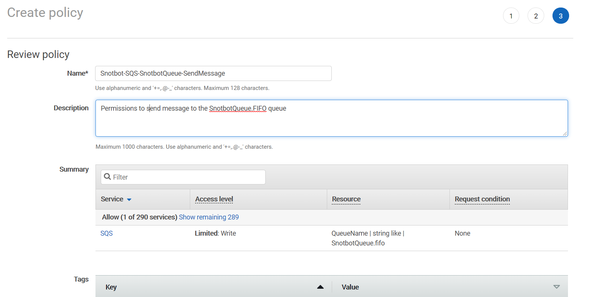
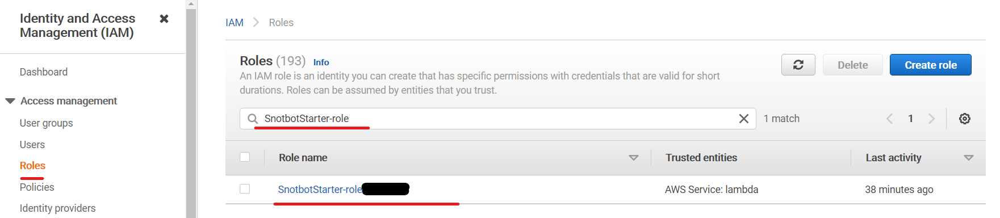
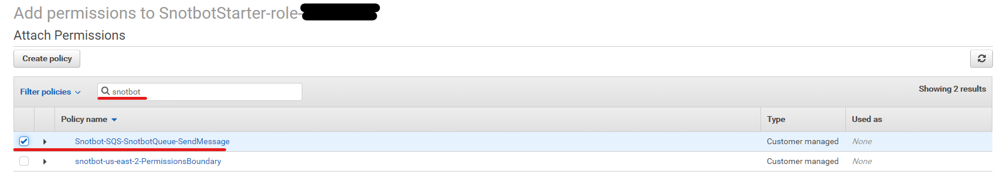

# AWS Identity and Access Management

## Overview

[AWS Identity and Access Management](https://aws.amazon.com/iam/) (also known as IAM) is Amazon's permissions service, where you can manage Users, User Groups, Roles and Policies:

- User: is an account a human uses in AWS to manipulate services
- User groups: how users can be defined into different types, e.g. developers, security, HR, accountants, etc. Each User group contains a set of Policies
- Roles: the permissions used by services (not Users). Each Role contains a set of Policies
- Policies: these are the building blocks of permissions. Each policy relates to a resource and what actions can be done on/to that resource

A good rule of thumb is to use the "Rule of Least Privilege", where you only assign permissions as they are required. An example might be a lambda function requiring access to Amazon SQS to send messages. Instead of giving that lambda function permission to do everything in SQS, only give it permission to send messages to the queue. Following this rule of thumb is a safe way to lock things down tight and ensure one service cannot accidently access another service.

When you create some new services, e.g. a new lambda function, it will automatically create a new Role in IAM with some basic policies. You can then simply access this role and modify/add policies (similar to what we did in the [SQS tutorial](./Amazon%20Simple%20Queue%20Service.md)).

## Getting started

For this getting started, we will modify a lambda function's role so that instead of using a policy that grants access to all SQS functionality, it has a policy that only allows it to send messages to a SQS queue. Sound familiar? This is what we did for the [SQS tutorial](./Amazon%20Simple%20Queue%20Service.md). To modify this role, we will make our own custom policy that has the correct permissions, delete the pre-existing policy on the role and add this new custom policy.

Prerequisites:

- You are logged in to the AWS Console with an account which has sysadmin privileges. If not and you are unsure how to do this, please follow through [Getting started with AWS](./Getting%20started%20with%20AWS.md) to set yourself up
- You finished the [SQS tutorial](./Amazon%20Simple%20Queue%20Service.md). If you have not done this, don't worry. Just follow along the steps and screenshots as it is the same process to change permissions for anything else within AWS.

To begin, search for IAM in the service search box on the top navigation bar and select the **IAM** search result. From here, click on the "Policies" section and then the "Create Policy" button.

At this point, choose "SQS" as the service, expand the **Write** section and select the "SendMessage" option only.

Next, click on the "Add ARN" link. This locks it down so that this policy only affects the queue we are about to specify and cannot be applied to other SQS queues.

In the popup, paste in the ARN of your SQS queue. To find this, go to your SQS queue and copy the ARN from the "Details" section at the top.

Move on through the creation of this policy until you get to the review page. At this point, enter in a meaningful name, description and then hit that "Create Policy" button.

Nice! So now we have the new policy created which only gives send message permissions, lets add this to the lambda which sends messages to the queue.

Click on the "Roles" section and search for the Role you wish to modify the permissions for (in this case the lambda which sends messages to the queue) and click on it, as shown below:

Next, click the cross to remove the AmazonSQSFullAccess policy from this role (note: this will break your current system temporarily). A popup should appear asking you to confirm you want to detach the policy from this role. Once you have done this, click on the "Attach Policies" button.

Once you are redirected, search for your newly created policy, select it and press the "Attach policy" button.

And that's it! So to recap what we just did:

- We created a new policy that only permits the sending of messages
- We removed an existing policy from a lambda function's role
- We added our new custom policy to the lambda function's role

As a side note, policy manipulation on Roles, User groups and Users is exactly the same! So what you see here will also apply to those as well.
