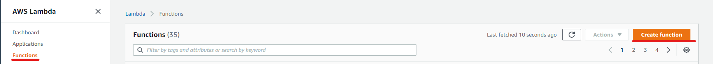
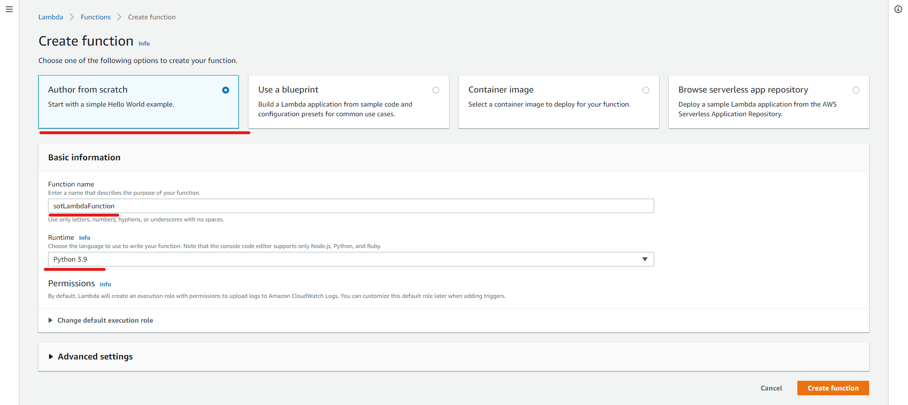
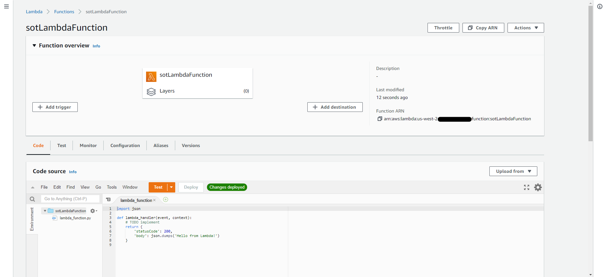

# AWS Lambda

## Overview

[AWS Lambda](https://aws.amazon.com/lambda/) is a serverless compute service in AWS. What is meant by serverless? It means you don't need to worry about provisioning servers to host your lambda to run it. This basically means all you need to worry about is selecting which coding language you want to use and start coding away.

AWS Lambdas can be described as functions, which are ideally only supposed to run for a few seconds at most. This makes them one of the most flexible services in AWS as you can use them for a range of things. A couple of use cases are:

- Data processing: this can be handy for machine learning if you want to apply some preprocessing steps to your data
- Backend for a website: lambdas can quickly perform computational tasks for a website and scale up and down to meet website traffic demand

## Getting started

This service is really easy to use and get started with. For this getting started, we will just create a hello world lambda function that uses Python 3.9.

Prerequisites:

- You are logged in to the AWS Console with an account that has sysadmin privileges. If not and you are unsure how to do this, please follow [Getting started with AWS](./Getting%20started%20with%20AWS.md) to set yourself up

To get started, in the AWS Console search for AWS Lambda in the search box and click on the top link to open the AWS Lambda page. You should be redirected to the "Functions" section within AWS Lambda, and if you are not please use the left-hand menu to navigate to access it. Once on this page, please click on the "Create Function" button, as shown below:

We now need to set up your new function. First off, select the "Author from scratch" option. This basically provisions everything in the simplest way so that it works straight out of the box, but still gives you plenty of flexibility to change what you need. After that, enter a name for your lambda function. Finally, select what runtime language you would like to use. There are a large range of options, but for the purposes of this exercise Python please select Python. Leave the advanced settings for now as you can tweak these later. Once you are done, press the "Create function" button.

You will then be redirected to your new lambda function once it is created. In the "Function Overview" section at the top you are provided with key information about your lambda, such as:

- Map of other AWS services being used as input to trigger this function (currently none, but would appear on the left by the "Add trigger" button)
- Map of other AWS services being used as output once the function has run (currently none, but would appear on the right by the "Add Destination" button)
- Function ARN: every instance of a service in AWS has an ARN (Amazon Resource Number). This is a unique value and allows you to find the service from other places

At this point, the lambda is ready to go! You could add to the source code and have a look at the settings. If you were to [add an API to trigger your new lambda](./Amazon%20API%20Gateway.md), you could then pass through some data and use the lambda to print out the contents and then use [Amazon CloudWatch](./Amazon%20CloudWatch.md) to see what you printed out in the logs.
