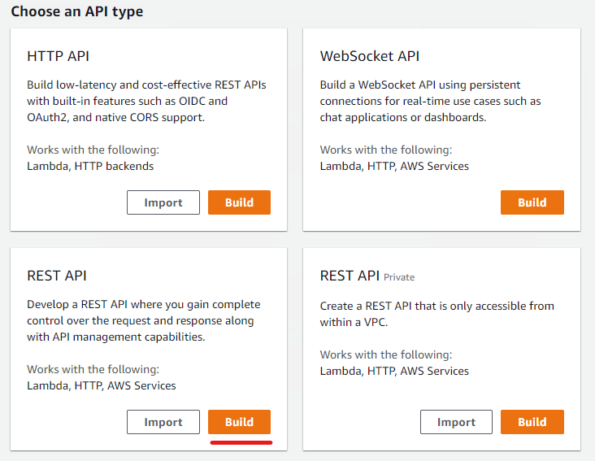
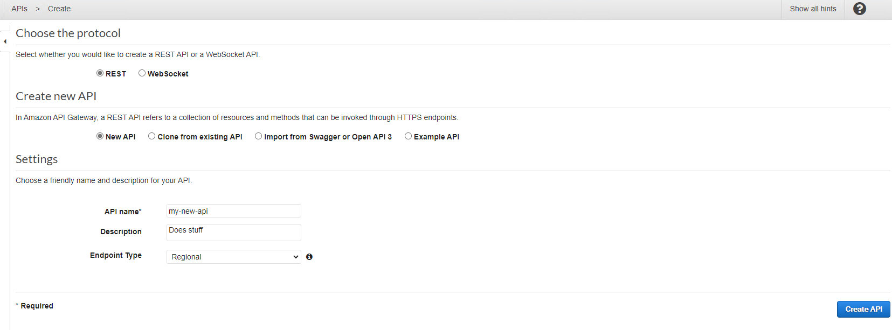
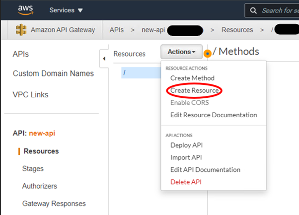
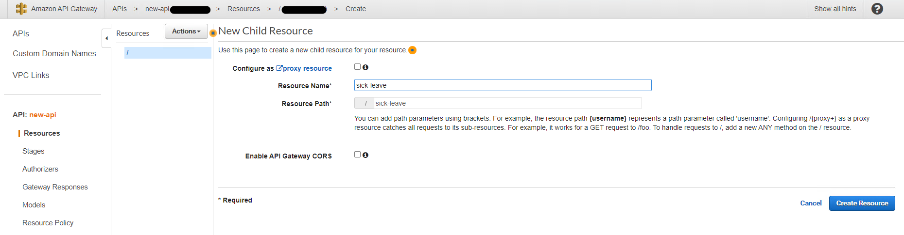
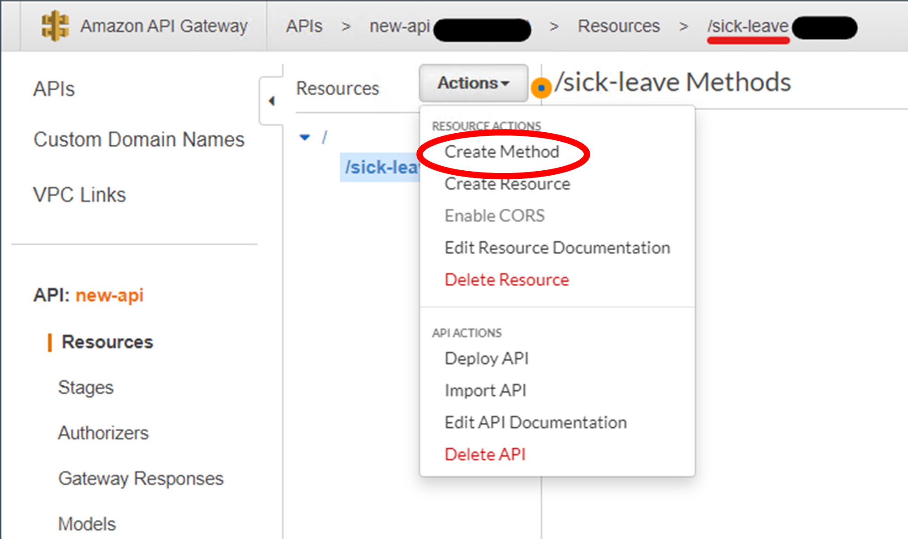
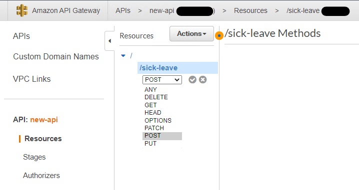
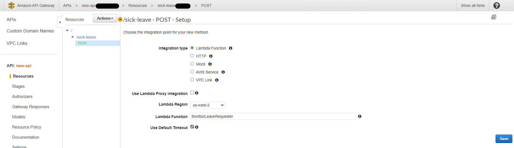
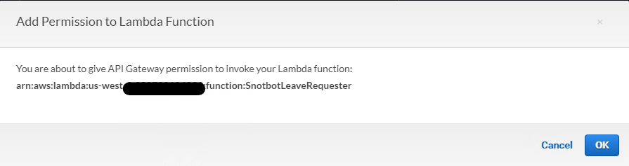
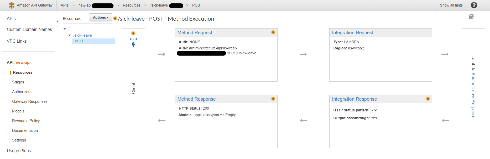

# Amazon API Gateway

## Overview

[Amazon API Gateway](https://aws.amazon.com/api-gateway/) allows you to create APIs in AWS. The API Gateway is commonly used as a triggering point for some process, e.g. a payload is received by an API within the API Gateway and its cotents are then sent to another AWS service for processing.

## What is an API?

An Application Programming Interface (API) is a software component which allows two different applications to talk to each other. An API is often the entry point for modern applications, where you can have a vast number of APIs as the entry points for different things. APIs also contain a layer of security, so they can help protect your application and ensure no malicious access is given.

For an example, imagine you walk into a fish and chip shop. You previously ordered online and are there to pay pick up your order. Think of yourself as an application, the kitchen as another application and the person at the counter as the API. When you say I am here to pay and pick up my online order under Daniel, you are authenticating with the person at the counter. They look at the tickets behind the counter and see an order for Daniel, so they know who you are. Now queue the API call, you hand them the cash to pay for your order. The person behind the counter takes the money and puts it in the cash register and then goes into the kitchen (other application) to grab the payload (1 scoop of chips, 2 fish and 1 spring roll). They then come back out the front and give you the payload in return. You have now just successfully called an API to pass through data (paying with money), which triggered a payload to be created in the other application (kitchen) and received that payload in return (your dinner).

## Getting started

For this getting started, we will create an API Gateway that sends a payload to an AWS Lambda once triggered.

Prerequisites to getting started:

- You are logged in to the AWS Console with an account which has sysadmin privileges. If not and you are unsure how to do this, please follow through [Getting started with AWS](https://github.com/Daniel-Hardie/summer-of-tech/blob/main/snotbot/Getting%20started%20with%20AWS.md) to set yourself up
- You have created a lambda function. If you have not yet done this, please head over to the [AWS Lambda page](https://github.com/Daniel-Hardie/summer-of-tech/blob/main/snotbot/AWS%20Lambda.md)

To get started, in the AWS Console search for API Gateway in the search box and click on the top link to open the API Gateway service page. Upon the page loading click on the "Create API" button.

At this point, you will then be prompted to pick the type of API you want to create. For the purpose of thie exercise, we want to pick the REST API type, which is probably the most common type of API used. Press the "Build" button on the non-private REST API type, as shown below:

You will now need to configure the properties this REST API. First of all, we want to select REST as the protocol and then we want to create a New API. In the settings sections, write in a descriptive API name, description and leave the Endpoint type as Regional. Press the "Create API" button when finished.

Now we need to set up the resources and methods. A resource can be described as the container that holds a collection of methods. A method is a single API endpoint, given a certain [HTTP Request Method](https://www.w3schools.com/tags/ref_httpmethods.asp)/type. A resource can only have one method of each of these types, where types include GET, POST, PUT and more. Each type has its certain purpose, e.g. the GET is like a read to retrieve information and a POST is to submit new information to create or update something.

Setting up a new resource is quite easy, all you need to do is click on the "Actions" dropdown and select the "Create Resource" option, as shown below

On the New Child Resource page, you will just need to add a Resource Name. The Resource Name should encapsulate just one part/entity apart of your entire system that you can perform different actions on. For example in Snotbot, calling it sick-leave is a suitable name as you can view how much sick leave is left, request to take sick leave, add sick leave days, etc. Here is an example of what I did using sick-leave:

Now that we have our resource set up, we need to add a method into it. To do this, click on the "Actions" dropdown menu, and select "Create Method"

This will then allow you to select the type (HTTP Request Method) for your new method. This is dependant on what you wish this method to achieve. For Snotbot a POST was used as we want to send the employee's name and leave reason into AWS from Slack.

Now you will want to set the properties of the new method you have just created. Keep the integration type as Lambda for this exercise and do NOT select "Use Lambda Proxy Integration". You will then need to select your lambda function from the dropdown menu. If it is not appearing, you are probably looking in the wrong region. To find what region you created your AWS lambda on, go back to your lambda function and click on the geographic location on the top right of your naviation bar. This will drop down and tell you the code that your lambda is in. For Snotbot, we used Oregon, which has a code of us-west-2. In the case of this API Gateway method that is being created here, I therefore put us-west-2 in the region in the screenshot below. This might be different for you, depending on where your lambda was created. Once this is all done, click "Save".

A popup should now appear asking permission to invoke your lambda function. Press the "Ok" button to allow this. What this will do under the hood is update your IAM permissions for your lambda and add a new policy to your lambda role that allows it to receive data from this API Gateway.

Finally, you should be taken back to the Resources screen. This will now show you that you have a REST API endpoint that when invoked sends a payload to your specified lambda function. In response, the lambda function then sends back an OK, which gets returns to the API Gateway, which the API Gateway will then return to whatever called the API. Seems simple enough? :P Don't worry if this all does not make sense, the best thing is just try to get the overview of what is happening. Learning about the more in depth stuff will come with experience and playing around with different services.

