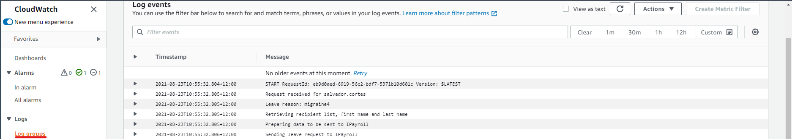

# Amazon Cloudwatch

## Overview

[Amazon CloudWatch](https://aws.amazon.com/cloudwatch/) is Amazon's monitoring service. There are four main areas within CloudWatch, Alarms, Logs, Metrics, and Events:

- Alarms: allow you to set certain conditions that when met, trigger a notification of some kind. This could be used to monitor when an AWS service breaks and quickly notify you so that it can be fixed
- Logs: these are output entries of data that occur when a program runs. For Lambdas, whenever you have a print statement/action or equivalent, they output to the logs so you can see the state of system as it was running
- Metrics: these are graphical visualisations that represent certain areas of performance for an AWS service over a period of time. For example, the lambda service has certain metrics such as number of time a lambda function was invoked, the number of errors it had and the duration the lambda function ran for
- Events are a set of rules that can trigger things to occur within AWS. An example rule could be for a database service that you want to snapshot at 7pm NZT every night. By configuring this as an Event, it will kick off the snapshot process at that time every evening

## Getting started

For this getting started, we will look at some log examples within a log group in CloudWatch.

Prerequisites:

- You are logged in to the AWS Console with an account which has sysadmin privileges. If not and you are unsure how to do this, please follow through [Getting started with AWS](./Getting%20started%20with%20AWS.md) to set yourself up

This service is a bit different to the others as you don't need to actually do anything to set up CloudWatch. The only thing required is that the correct [IAM](./AWS%20Identity%20and%20Access%20Management.md) policies are used on a service's role so that it has access to CloudWatch to create logs, etc. When you create a new service, e.g. a lambda function, often these will come with the CloudWatch policies in place automatically.

To see the logs for a lambda, search for CloudWatch in the services search bar. Click on the CloudWatch result and navigate to the "Log group" option in the left menu. From here, filter the log groups by the name of your lambda and click on the timestamp of logs you wish to see. Doing so will present something like this, but the contents will reflect what your lambda has printed out:

