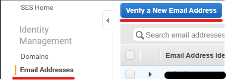

# Amazon Simple Email Service

## Overview

[Amazon Simple Email Service](https://aws.amazon.com/ses/) (also known as Amazon SES) is Amazon's email service, which allows you to send emails.

## Getting started

For this getting started, we will use a lambda function with a Python runtime to send emails via SES.

Prerequisites:

- You are logged in to the AWS Console with an account which has sysadmin privileges. If not and you are unsure how to do this, please follow through [Getting started with AWS](https://github.com/Daniel-Hardie/summer-of-tech/blob/main/snotbot/Getting%20started%20with%20AWS.md) to set yourself up
- You have created a lambda function with a Python runtime. If you have not yet done this, please head over to the [AWS Lambda page](https://github.com/Daniel-Hardie/summer-of-tech/blob/main/snotbot/AWS%20Lambda.md)

If you think about what is required to send an email, you need a sender email, receiver email, email subject and email body. For starters, we will focus on the sender and receiver email addresses and how to get them set up in SES. To keep this tutorial simple, we will be using the bare bones of SES, which means that you first need to verify the sender and receiver email addresses in SES. This is because by default, SES is in "sandbox mode", which is how you test SES as a new user. This is not practical if you want to send emails to people and can't verify their email addresses, but to do this it costs extra to come out of sandbox mode. For the purposes of this tutorial, we will be only using sandbox mode.

To verify email addresses in SES is quite simple. Head over to the "Email Addresses" side menu option in the "Identity Management" section and press the "Verify a New Email Address" button, as shown below:



A new popup box should appear, where you enter in the desired email address you wish to verify. Once this is done, hit the "Verify This Email Address Button" and you should receive an email in that email's inbox to verify. As usual, if it does not show up in a few mins check your spam folder.

After this is done, you should see that the email address is verified in the "Email Addresses" section. Make sure you use this process to verify an email account you wish to be the sender and at least one different email account to be the receiver(s).

Now that we have the email addresses set up, we need to create an email subject and body in a lambda function and send it through to SES. Consider the following code snippet of a lambda:

```python
import json
import boto3
from botocore.exceptions import ClientError

sender = "sender@snotbot.com"
recipients = ["boss@work.com", "payroll@work.com", "teammate1@work.com"]
awsRegion = "us-west-2"

# Email contents
subject = "Daniel is sick today"
bodyText = ""
bodyHtml = "He is not feeling too well and wanted me to let you know. Cheers, Snotbot"
charset = "UTF-8"

def CreateAndSendEmail():
    # create new SES resource using boto3 library
    client = boto3.client('ses',region_name=awsRegion)

    # try to send the email
    try:
        #Provide the contents of the email.
        response = client.send_email(
            Destination={
                'ToAddresses': recipients
            },
            Message={
                'Body': {
                    'Html': {
                        'Charset': charset,
                        'Data': bodyHtml,
                    },
                    'Text': {
                        'Charset': charset,
                        'Data': bodyText,
                    },
                },
                'Subject': {
                    'Charset': charset,
                    'Data': subject,
                },
            },
            Source=sender,
        )
    # Display an error if something goes wrong.
    except ClientError as e:
        print(e.response['Error']['Message'])
    else:
        print("Email sent! Message ID:"),
        print(response['MessageId'])

CreateAndSendEmail()
```

Going through, we first need to set up sender and recipient email addresses, where the recipients can be stored as a string list. Next we are declaring what AWS region the SES service we are using is in, which should ideally be in the same region as this lambda. Finally, we create the email contents that will be used in the email.

Stepping through the CreateAndSendEmail method (which should be split out into two seperate methods 🤫) we first create a reference to the SES service with client using Boto3. [Boto3](https://boto3.amazonaws.com/v1/documentation/api/latest/index.html) is the Python AWS SDK, which allows us to invoke AWS commands through code, which is pretty cool! So by creating this client with SES, we can basically use SES functionality from within our lambda code.

After the client is set up, we then create the email and send it using the client. If we get a successful response from SES, we receive back a message id (which is printed out to [Amazon CloudWatch](https://github.com/Daniel-Hardie/summer-of-tech/blob/main/snotbot/Amazon%20CloudWatch.md)). If we do not get a successful response, the error is then printed out into the logs so we can investigate further to see what the problem is.

And just like that, you can now send emails from a lambda function using SES!
