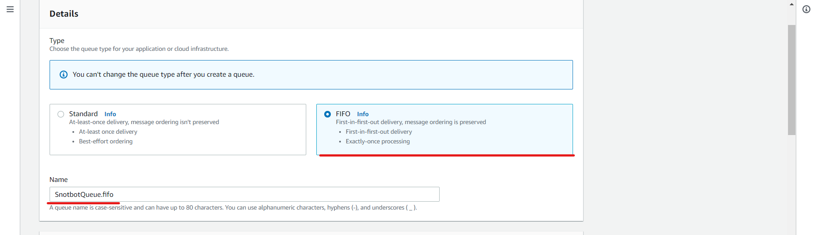

# Amazon Simple Queue Service

## Overview

[Amazon Simple Queue Service](https://aws.amazon.com/sqs/) (also known as Amazon SQS) is Amazon's message queuing service. A message queue is used to send messages between software components; messaging helps promote [decoupled applications](https://www.cloudamqp.com/blog/why-is-application-decoupling-a-good-thing.html).

Amazon SQS therefore allows communication between different AWS services, where a service can place a message (usually contain some data/payload) on the queue and the other service can receive and consume the message, using any data in the message to do something. There are two different types of queue in Amazon SQS, standard and FIFO:

- Standard queues allow at least once delivery. This means that the message could get processed more than once in some scenarios. This allows for maximum throughput as the queue does not have to care if a message is processed only once, it can just keep trying and trying until it receives a good response back. This can cause potential problems if your appplication is does not handle [idempotent operations](https://stackoverflow.com/questions/1077412/what-is-an-idempotent-operation)
- FIFO (First In First Out) queues process messages in the order they arrive in the queue. They also ensure that each message is processed successfully only ONCE. If a message is not successfully processed as it leaves the queue, it will rejoin at the back of the queue.

## Getting started

For this getting started, we will follow the process that was used to add the queue to Snotbot. At a high level overview, we will
make a queue and connect it to a [lambda function](./AWS%20Lambda.md) which places messages on the queue, and a lambda function which receives messages from the queue. We will also need to create the appropriate [IAM](./AWS%20Identity%20and%20Access%20Management.md) policies and assign them to the lambda roles so that both lambdas have the correct level of access to the queue.

Prerequisites:

- You are logged in to the AWS Console with an account which has sysadmin privileges. If not and you are unsure how to do this, please follow through [Getting started with AWS](./Getting%20started%20with%20AWS.md) to set yourself up
- You must have created two distinct lambda functions. If you have not yet done this, please head over to the [AWS Lambda page](./AWS%20Lambda.md) and create two Hello World lambda functions.

To get started, head over to the AWS Console and in the service search bar, search for **sqs** and select the **Simple Queue Service** result. Make sure you are in the same AWS region as the two lambdas you created (e.g. Oregon us-west-2 if you used this - you can check in the top right of the top navigation bar in the dropdown). Next, click on the "Create queue" button.

The first thing to select is what type of queue you want to use. For Snotbot, we decided to use FIFO (First In First Out) because it ensures messages will not be processed twice (it would be bad to request leave for the same person more than once)! So if you want to make your own FIFO queue, select the option as shown in the screenshot below and enter a name for your queue.



Next we need to fine tune the configuration of your queue. You can probably leave everything by default here initially, and once you are more comfortable with SQS I would strongly recommend changing these settings to suit your project.


Finally, we need to set up the permissions for what can access this queue. Leave the method as "Basic" and for defining both who can send and receive messages to the queue, select the "Only the specified AWS accounts, IAM users and roles" option, as shown below.


Now, you are probably wondering what those values are that we have put in the text boxes. They are each a lambda function's role ARN (Amazon Resource Number). If you are unfamiliar with Roles within IAM, please see this page [here](./AWS%20Identity%20and%20Access%20Management.md) to get started. To give a quick summary, an IAM role allows us to control what a service can access. By explicitly putting the Role ARN (Amazon Resource Number - which is a value unique to a role (or to any Amazon resource)) here, when the queue is created it only allows services with those roles to either send a message to the queue or read a message from the queue. This stops other AWS services from accidently adding stuff to this queue. Don't worry if this does not make sense, it should get clearer what is happening as we go on.

Alright, so to recap, at this point you should have a lambda function which you will use to send messages to the queue, and another lambda function to receive messages from the queue. Each lambda will have their own Role in AWS IAM that we need to go and get for setting up our new queue.
Open a new tab and in the top navigation bar search for IAM and click on the **IAM** search result. Next, go to the "Roles" section and search for the name of the lambda function which will send messages to the queue, similar to below:


Click on your lambda function and copy the whole Role ARN value


Now go back to the queue you are creating and paste it in the top text box, as shown below:


Repeat the process for the other lambda which you want to use to receive messages from the queue. Add this lambda function's role's ARN to the other text box for the queue permission setup. After you have done this, press the **Create queue** button at the bottom of the screen to finish creating the queue.

So, at this point we have a new queue set up that lets one lambda send messages to it and one lambda read messages from it. The only trouble is, do the lambdas themselves know about this? (Answer: they don't)

## Setting up the lambda which sends messages to the queue

Lets focus on getting the first lambda sending messages to the queue. Lets jump into the lambda you have made and add in this code:

```python
import boto3
import random
from botocore.exceptions import ClientError

# Change this to your SQS queue's URL
sqsQueueUrl = 'https://sqs.us-west-2.amazonaws.com/123456789/YourQueue.fifo'
payload = "Hello World"

def sendSQSMessage():
    sqsClient = boto3.client('sqs')
    # The id is used to stop duplication of a message
    id = str(random.randint(0,999999999999999))

    try:
        msg = sqsClient.send_message(QueueUrl=sqsQueueUrl, MessageBody=payload, MessageGroupId=id, MessageDeduplicationId=id)
    except ClientError as e:
        print(e)
        return None
    return msg

sendSQSMessage()
```

Going through this code snippet, we need to first know your queue's URL, so overwrite the URL provided with your own. You can find this in the "Details" section of your queue in SQS. A payload has also been defined, which can be anything! We will just use the string "Hello World" for now. Next up, we will use the [Boto3](https://boto3.amazonaws.com/v1/documentation/api/latest/index.html) library to create a reference to the SQS service. Boto3 is the Python AWS SDK, which allows us to invoke AWS commands through code, which is pretty cool! So by creating this client with SQS, we can basically use SQS functionality from within our lambda code.

After the client is set up, we then generate a random id so that we can use it to identify the message. FIFO has in built protections to stop duplicate messages, which use this id that we generate. Finally, we send a message to the queue with our payload and id and capture the message sent back.

Now that we have code configured to call SQS, we need to set up the lambda function so it has the permissions to communicate with SQS. To do this, go back to your IAM tab that contains the policies for your lambda function and click on the "Attach Policies" button. As a recap, a policy is a set of permissions for within AWS.


On the Add permissions page, search for sqs, select the AmazonSQSFullAccess policy and press the "Attach Policy" button.


And that's it! The first lambda should be able to add messages to your new queue on SQS!

## Setting up the lambda which receives messages from the queue

Now we are on to the final part, which is setting up the second lambda to ensure it can receive messages from your queue. First of all, let's make sure your lambda has the correct SQS permissions so that it can read from the queue. Go back to your IAM tab that contains the Role for your second lambda and click on the "Attach Policies" button, as shown below:


Search for sqs in the search box and select the "AWSLambdaSQSQueueExecutionRole" as this comes with the sqs:ReceiveMessage permission, which is what you need to be able to receive messages from a SQS queue. Click on the "Attach policy" button.


Now that your receiving lambda has the right permissions, lets hook it up to your queue! Go back to your lambda function and on the Function overview section click on the "Add Trigger" button, as shown in the image below:


This will redirect you to a new page, where you will need to select a trigger type of SQS from the dropdown menu at the top. You will then need to enter your SQS queue's name in the box below; it should find your queue, so click on that option. If your queue is not present, make sure that your lambda and queue are in the same AWS region (using the top right dropdown menu in the navigation header). Also, make sure you leave the "Enable trigger" ticked so that this all works straight away. Click the **Add** button to proceed.


You will now be redirected back to your lambda function and might notice two things:

1. SQS now appears as a trigger in the Function overview
2. In the Configuration section down below, you will see that it is "Creating" this trigger. Give this a minute or so to complete, it is pretty quick.


And that is it! You now have a lambda which can receive messages off a SQS queue. If you got to this point, you are well-and-truly on your way to becoming an AWS expert!
